layout: true
class: animated, fadeIn

---
class: center, top
.title-spacer[

]
## Secrets of a
# Front End Ninja*

.footnote[*Senior Front End Developer]

---
class: center, top
.title-spacer[

]
## Secrets of a
# Front End Ninja*

### 2017 Edition
.logo[]

.footnote[Image by [Thăngfly](https://www.facebook.com/thangfly/)]
---

# About me:

### Trần Trọng Thanh

- CTO of [NauStud.io](https://naustud.io)
- Front End Architect
- 4 years with Flash / ActionScript
- 6 years with Web Front End & JavaScript
- Currator of SaigonJS FB group

.fa.fa-github-alt[] [/trongthanh](https://github.com/trongthanh)
.fa.fa-twitter[] [@trongthanh](https://twitter.com/trongthanh)
.fa.fa-facebook[] [fb.me/trongthanh](https://facebook.com/TrongThanh)

.logo[]
.logo[]

---

# Agenda

- Modern Front End developers, who are they?
- The baseline skill set of a modern F.E. dev.
- Roadmap to Senior Front End Developer
- How to get started and improve as a Front End developer by yourself
  - [Sub-topic] The chicken & egg paradox of Front End learning
- **Front End Trend 2017** 👍
- Q&A

---
class: center, middle
# Modern Front End Developers
## Who are they?

.footnote[Image from [blog.debugme.eu](http://blog.debugme.eu/great-front-end-developer/)]
---
layout: true
class: animated, fadeIn
.topic[Modern Front End Developers]

---

## The roles before Front End

- Web Developer
- HTML / UI Developer
- Web Designer

---

## Web Developer

- Proficient in one of server-side languages (PHP, .NET...)
- Good at data & SQL
- Can do basic HTML+CSS, jQuery
- Very little skill with UI tools
- Favorite OS & tools: Linux, Terminal, IntelliJ, Netbeans

  <table class="q-graph">
    <caption>Web Developer (Full Stack Developer)</caption>
    <tbody>
      <tr class="qtr q1">
        <th scope="row">HTML</th>
        <td class="sent bar" style="height: 50%;">

</td>
      </tr>
      <tr class="qtr q2">
        <th scope="row">CSS</th>
        <td class="sent bar" style="height: 25%;">

</td>
      </tr>
      <tr class="qtr q3">
        <th scope="row">JavaScript</th>
        <td class="sent bar" style="height: 75%;">

</td>
      </tr>
      <tr class="qtr q4">
        <th scope="row">UI Skills</th>
        <td class="sent bar" style="height: 10%;">

</td>
      </tr>
    </tbody>
  </table>

  

    

100%

    

75%

    

50%

    

25%

  

---

## HTML / UI Developer

- Mostly CAN'T do server side
- Proficient in HTML+CSS
- Can do basic JS, jQuery
- Good at slicing images with Photoshop
- Favorite OS & tools: Windows, Photoshop, Notepad++, Dreamweaver

  <table class="q-graph">
    <caption>HTML / UI Developer</caption>
    <tbody>
      <tr class="qtr q1">
        <th scope="row">HTML</th>
        <td class="sent bar" style="height: 80%;">

</td>
      </tr>
      <tr class="qtr q2">
        <th scope="row">CSS</th>
        <td class="sent bar" style="height: 90%;">

</td>
      </tr>
      <tr class="qtr q3">
        <th scope="row">JavaScript</th>
        <td class="sent bar" style="height: 30%;">

</td>
      </tr>
      <tr class="qtr q4">
        <th scope="row">UI Skills</th>
        <td class="sent bar" style="height: 50%;">

</td>
      </tr>
    </tbody>
  </table>

  

    

100%

    

75%

    

50%

    

25%

  

???
This is a position in compensate to Web developer, whose main task is to slicing and convert
PSD files into static HTML layout

---

## Web Designer

- CAN'T do server side
- Knows little HTML+CSS, JS, jQuery
- Good at Photoshop and other Adobe tools
- Can create new UI from scratch
- Favorite OS & tools: macOS, Photoshop, Illustrator, Dreamweaver

  <table class="q-graph">
    <caption>Web Designer</caption>
    <tbody>
      <tr class="qtr q1">
        <th scope="row">HTML</th>
        <td class="sent bar" style="height: 25%;">

</td>
      </tr>
      <tr class="qtr q2">
        <th scope="row">CSS</th>
        <td class="sent bar" style="height: 25%;">

</td>
      </tr>
      <tr class="qtr q3">
        <th scope="row">JavaScript</th>
        <td class="sent bar" style="height: 10%;">

</td>
      </tr>
      <tr class="qtr q4">
        <th scope="row">UI Skills</th>
        <td class="sent bar" style="height: 100%;">

</td>
      </tr>
    </tbody>
  </table>

  

    

100%

    

75%

    

50%

    

25%

  

---
class: center, middle

## That was 2000's

---

## The causes of the rise of Front End

.column[
- AJAX evolution (2005)
- HTML5 & CSS3 evolution (2008)
- Steve Job's Thought on Flash open letter (2010)
]

--

.top-right[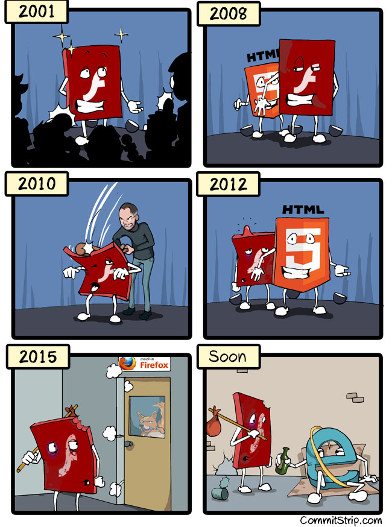]

.footnote[Image by [CommitStrip](http://www.commitstrip.com/en/2015/07/15/a-brief-history-of-flash/)]

???
https://en.wikipedia.org/wiki/Ajax_(programming)
https://en.wikipedia.org/wiki/HTML5
http://www.apple.com/hotnews/thoughts-on-flash/

---

## Front End Developer 😎

- Can't do server side but very good at AJAX
- Proficient in HTML+CSS
- Proficient in JS, JS frameworks, SPA*
- Can convert PSD to HTML, OK at UI tools
- Favorite OS & tools: macOS, Photoshop, SublimeText, Webstorm

  <table class="q-graph">
    <caption>Front End Developer</caption>
    <tbody>
      <tr class="qtr q1">
        <th scope="row">HTML</th>
        <td class="sent bar" style="height: 90%;">

</td>
      </tr>
      <tr class="qtr q2">
        <th scope="row">CSS</th>
        <td class="sent bar" style="height: 90%;">

</td>
      </tr>
      <tr class="qtr q3">
        <th scope="row">JavaScript</th>
        <td class="sent bar" style="height: 90%;">

</td>
      </tr>
      <tr class="qtr q4">
        <th scope="row">UI Skills</th>
        <td class="sent bar" style="height: 50%;">

</td>
      </tr>
    </tbody>
  </table>

  

    

100%

    

75%

    

50%

    

25%

  

.footnote[* Single Page Application]

---

## Honorably mentioned:

.float-right[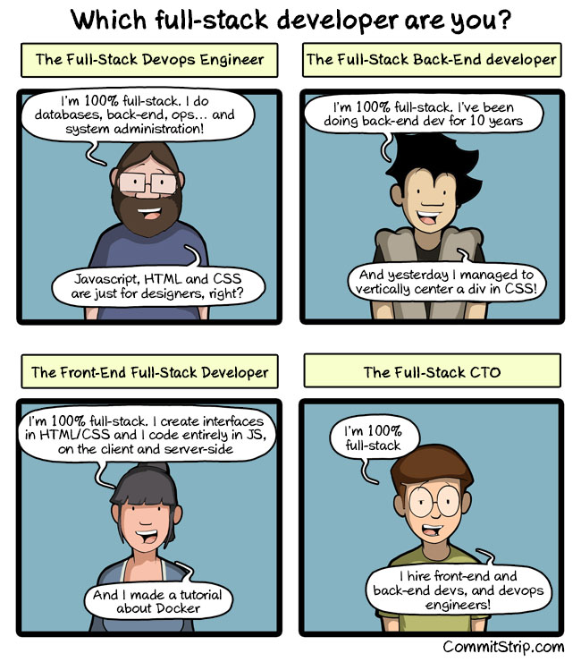]

- Back End developers
- Full-stack developers
- JavaScript developers
- NodeJS developers

.footnote[Image by [CommitStrip](http://www.commitstrip.com/en/2016/11/07/which-full-stack-developer-are-you/)]

---
layout: true
class: animated, fadeIn

---

class: center, middle
# The baseline skill set of a modern Front End developer

.center[]

---

# The baseline skill set of a modern Front End developer

- Web Front End Principles
- The languages
  - HTML
  - CSS
  - JS
  - "UI Language"
- Tooling skills
- Workflow

???
Based on my baseline for Front End developer article, but with some 2017 updates.

---
layout: true
class: animated, fadeIn
.topic[Front End Baseline]

---

## The 80/20 Rule* in learning  Front End

.footnote[AKA. Pareto principle, the law of the vital few]

--
- **80%** of daily work comes from **20%** of the F.E. knowledge

--
- **80%** of new JS frameworks can be understood well with **20%** of JS basic knowledge
- ...

---

## The article that goes viral

.center[[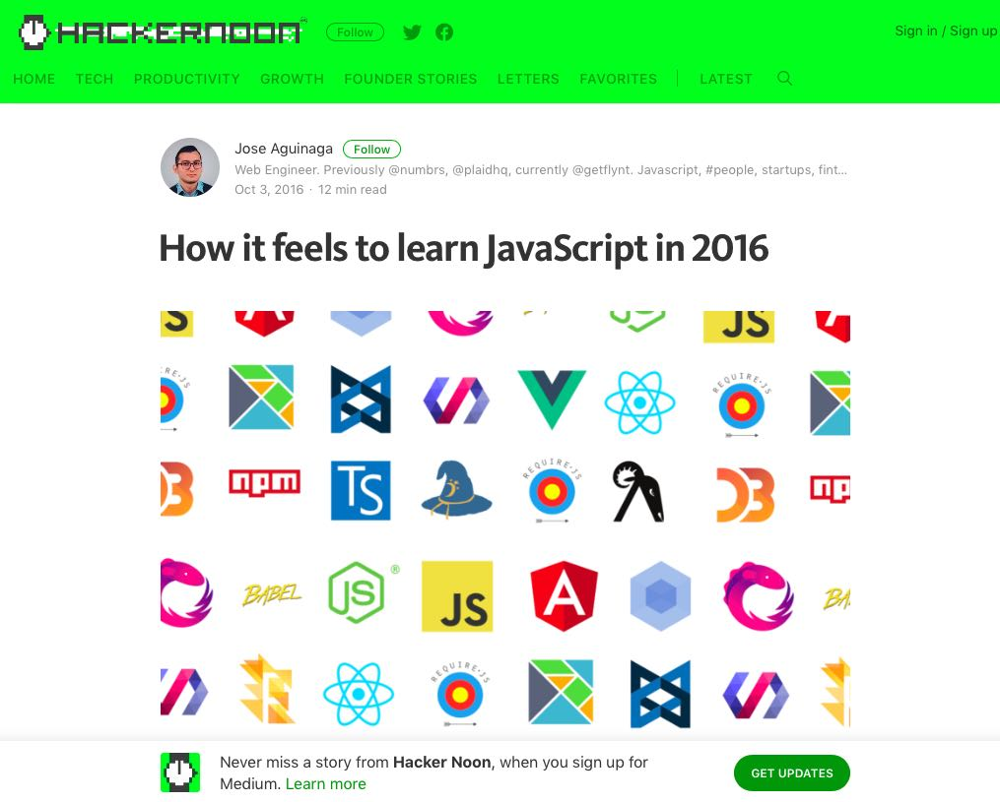](https://hackernoon.com/how-it-feels-to-learn-javascript-in-2016-d3a717dd577f)]

.footnote[Vietnamese version [here](https://techtalk.vn/buc-tranh-toan-canh-javascript-nam-2016.html)]

---

## Among the sea of keywords...

AJAX AMD Angular Atom await Axios Babel Bluebird Bower Broccoli Browserify Browsersync callback Chrome class closure CommonJS devtools DotJS DustJS ECMAScript 6 EJS Ember Emmet ES2016 eslint Fetch Firefox FlowType Flummox Flux Functional programming generator Grunt Gulp Handlebars High order functions hoisting HTML HTTP/2 Internet Explorer Jade Jade Jasmine JavaScript Jest jQote jQuery jQuery-tmpl JSRender JSX jTemplates KnockoutJS literals live-reload live-server lodash Makefiles MarkupJS Mimosa Mocha ES6 Module MS Edge Mustache MVC NextJS NodeJS npm Nunjucks Opera Phonegap PlatesJS polyfill Preact Progressive Enhancement Promise Prototypal inheritance Pug PURE Pure functions Ramnda React React DOM Redux Request REST RxJS Safari Sublime Text SystemJS this Transparency Typescript underscore variables VSCode VueJS Webpack Webstorm XMLHttpRequests

---

## You just need to focus on these:

.fade[AJAX AMD Angular Atom await Axios **Babel** Bluebird Bower Broccoli Browserify Browsersync **callback** Chrome **class** **closure** CommonJS **devtools** DotJS DustJS **ECMAScript 6** EJS Ember **Emmet** ES2016 **eslint** **Fetch** Firefox FlowType Flummox Flux **Functional programming** generator Grunt Gulp Handlebars High order functions **hoisting** **HTML** HTTP/2 Internet Explorer Jade Jade Jasmine **JavaScript** Jest jQote jQuery jQuery-tmpl JSRender JSX jTemplates KnockoutJS literals live-reload live-server **lodash** Makefiles MarkupJS Mimosa Mocha **ES6 Module** MS Edge Mustache MVC NextJS NodeJS **npm** Nunjucks Opera Phonegap PlatesJS polyfill Preact **Progressive Enhancement** **Promise** **Prototypal inheritance** Pug PURE Pure functions Ramnda React React DOM Redux Request REST RxJS Safari Sublime Text SystemJS **this** Transparency Typescript underscore **variables** VSCode VueJS Webpack Webstorm XMLHttpRequests]

---
class: center, middle
## Web Front End Principles

---
layout: true
class: animated, fadeIn
.topic[Front End Baseline > Web Front End Principles]

---
class: center, middle
## Progressive Enhancement

???
Explain a bit about PE

---

## Progressive Enhancement

.center[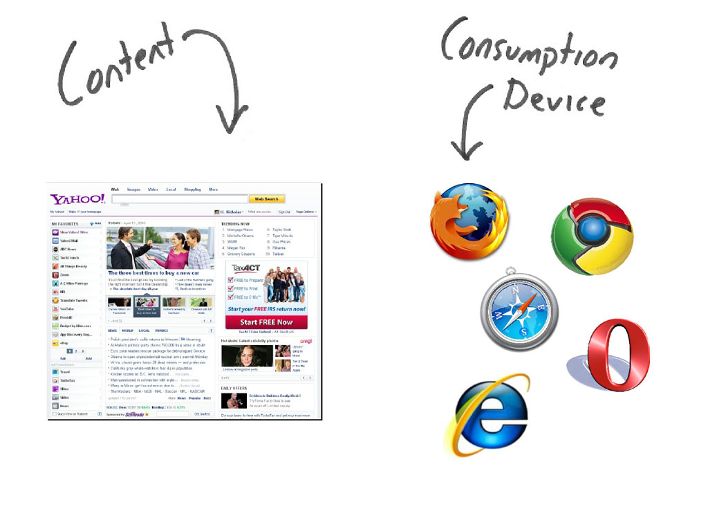]

---

## Progressive Enhancement

.center[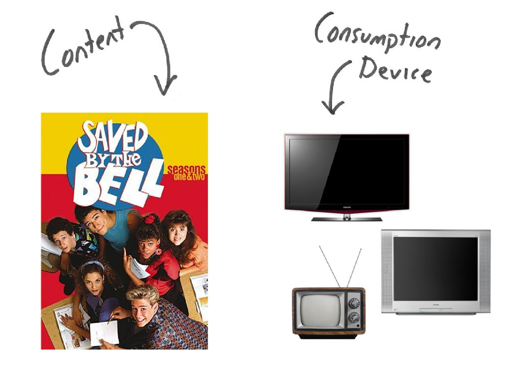]

---

## Progressive Enhancement

.center[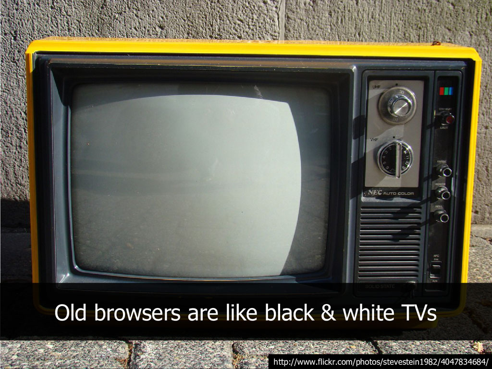]

---

## Progressive Enhancement

.center[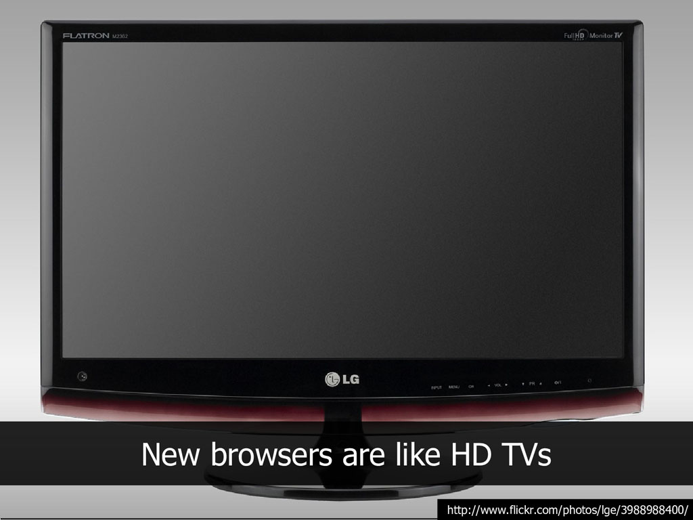]

---

## Progressive Enhancement

.center[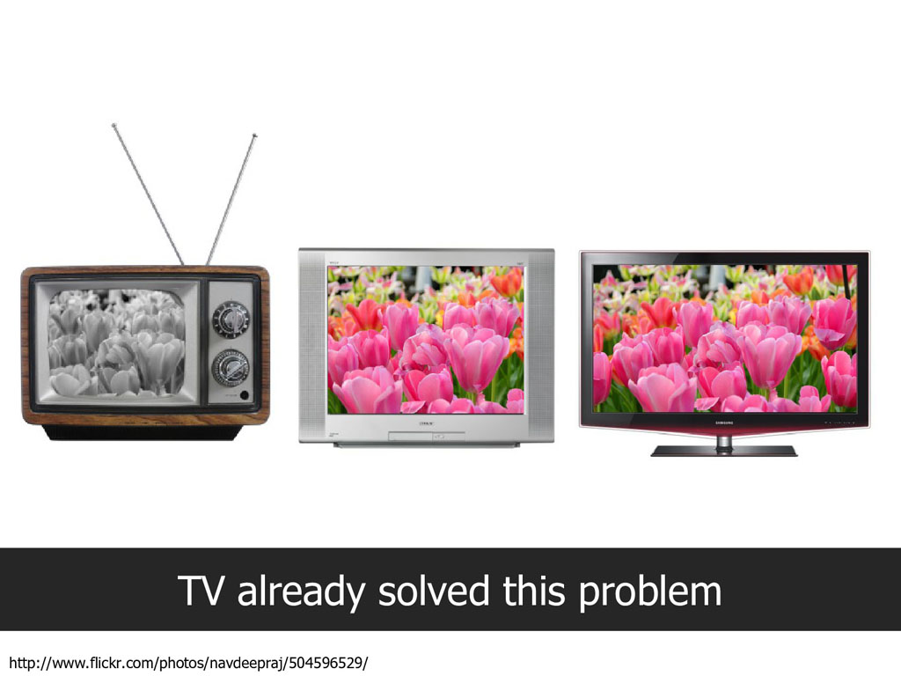]

---

## Progressive Enhancement

.center[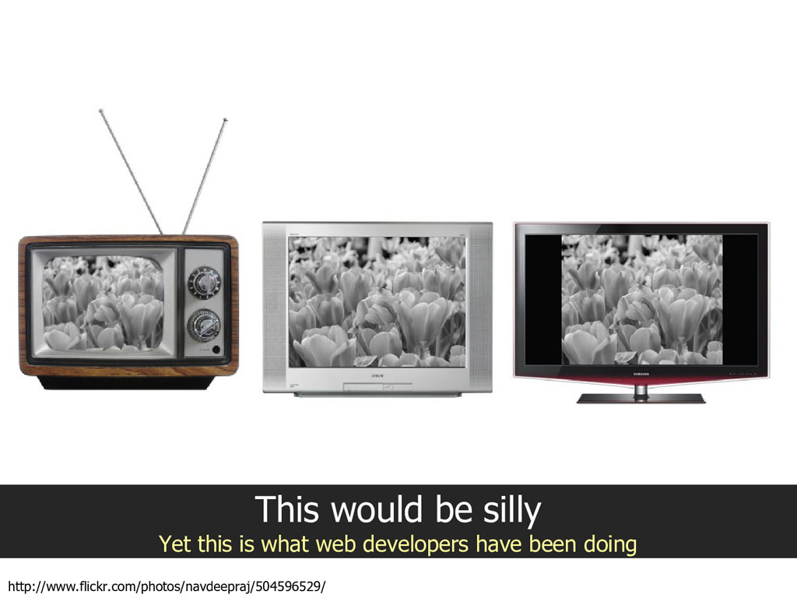]

---

## Progressive Enhancement

.center[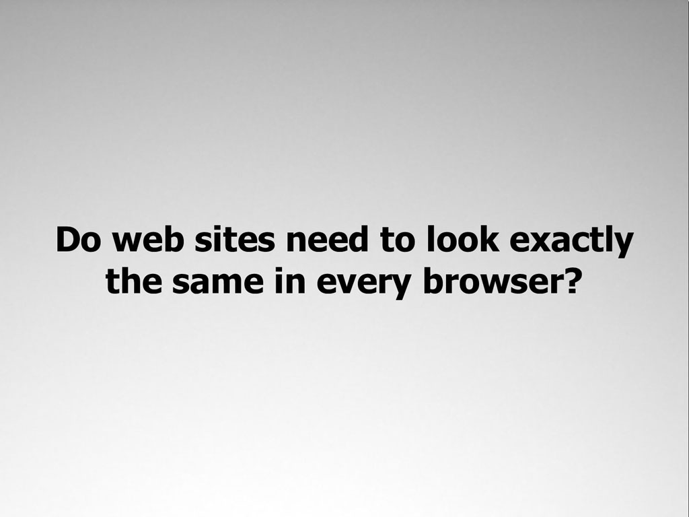]

---

## Progressive Enhancement

.center[]

---

## Progressive Enhancement

.center[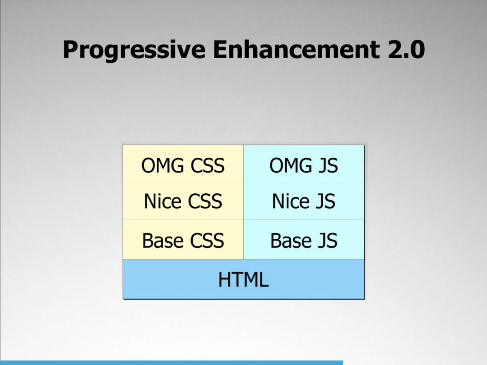]

---
class: center, middle
## Mobile First

---

## Mobile First

Internet users on mobile* exceed ones on desktop since 2014

.center[]

.footnote[*include internet mobile apps]

---

## Mobile First

Website visitors on mobile exceed ones on desktop 12/2016

.center[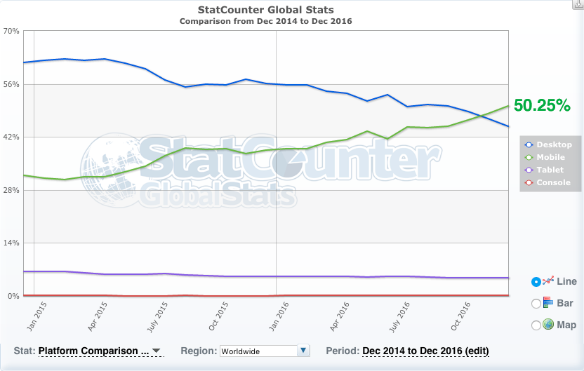]

.footnote[Source: [Statecounter](http://gs.statcounter.com/#all-comparison-ww-monthly-201412-201612)]

---

## Mobile First

- Responsive web design
- CSS media query approach (max-width -> min-width)
- Touch friendly UI
- Load fast (less than 1s is ideal)

---
class: center, middle
## User Experience > Developer Experience

---

## User Experience > Developer Experience

Example:

- Client side validation
- Transition and functional animations
- Server-side rendering
- ...

???
Example for transition:
- pseudo class :hover :active

---
## User Experience > Developer Experience

See the Pen <a href="http://codepen.io/sdras/pen/LEorev/">Form with Animation That Assists in UX</a> by Sarah Drasner (<a href="http://codepen.io/sdras">@sdras</a>) on <a href="http://codepen.io">CodePen</a>.

.footnote[Demo by [Sarah Drasner](http://codepen.io/sdras)]

---
layout: false
class: animated, fadeIn, center, middle
.topic[Front End Baseline]

## The Languages

---
layout: true
class: animated, fadeIn
.topic[Front End Baseline > Languages]

---
## HTML

--
- Understanding of document flow:
  - Rendering order
  - inline vs. block

--
- HTML elements default style know-how

--
- HTML Form and Input

--
- Semantic HTML

---
background-image: url(img/h5d-sectioning-flowchart.png)
background-size: contain

### Example:

.footnote[Source [HTML5Doctor](http://html5doctor.com/resources/)]

---

## CSS

--
- Cascading rules

--
- Selectors and specificity

--
- The box model

--
- Stacking context

---
background-image: url(img/specificitywars.jpg)
background-size: contain

### E.g: Specificity War

.footnote[Source [stuffandnonsense.co.uk](https://stuffandnonsense.co.uk/archives/css_specificity_wars.html)]

---

## JavaScript

- Dynamic typing

--
- Function scope and Closure

--
- Prototypal inheritance

--
- Object literals ({}, [])

---

### E.g: JS Equality Table

.center[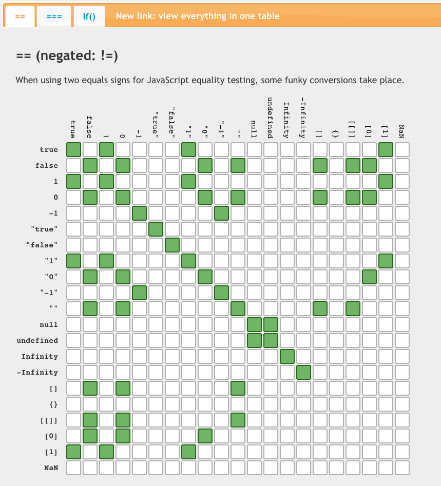]

.footnote[Source [dorey.github.io](https://dorey.github.io/JavaScript-Equality-Table/)]

---

## UI Language

- Speak designer jargons
- Understand typography
- Understand color mixing
- Understand image formats and image optimization

???
Jargons: hamburger button, hero banner, above the fold, parallax
Typography: sans vs. sans-serif fonts, base line,

---
layout: false
class: animated, fadeIn, center, middle
.topic[Front End Baseline]

## Tooling skills

---
layout: true
class: animated, fadeIn
.topic[Front End Baseline > Tooling]

---

## Tooling skills

.column[
- Code Editor:
  + Multi-cursor
  + Autocompletion
  + Live code linting
  + Fuzzy file search
  + Emmet
]

--

.right[
  .logo[]
]
.right[Visual Studio Code]

---

## Tooling skills

- Browser Devtool: Chrome Devtool

--
- Terminal / command line
  + NodeJS
  + npm
  + live-server

--
- Git tool: SourceTree, CLI

--
- Photoshop

--
- Illustrator

--
- Sketch app (macOS only)

---

### SketchApp Export demo:

.center[
<iframe width="560" height="315" src="https://www.youtube.com/embed/MLQ7_g5cNbU" frameborder="0" allowfullscreen></iframe>
]

---
layout: false
class: animated, fadeIn
.topic[Front End Baseline]

# Workflow

> "All code in any code-base should look like a single person typed it, no matter how many people contributed." - from [Idiomatic.js](https://github.com/rwaldron/idiomatic.js/)

--

- Adopt a code style: Google, AirBnb, [Nau](http://code.naustud.io), your own
- **dotfiles**
  - **eslint**: [airbnb](https://github.com/airbnb/javascript), [naudotfiles](https://github.com/naustudio/javascript)
  - **stylelint**: [airbnb](https://github.com/airbnb/css#css), [naudotfiles](https://github.com/naustudio/generator-naujs/blob/master/generators/app/templates/stylelintrc)
  - **editorconfig**
- **webpack**: file bundler and loader
- Automation:
  - **gulp**
  - npm scripts + bash scripts
- **Gitflow**: source control workflow

---
class: animated, fadeIn, center, middle

# Roadmap to Senior Front End Developer

.center[]

.footnote[Image source [map2app](http://www.map2app.com/jobs/)]

---
layout: true
class: animated, fadeIn

---

# Roadmap to Senior Front End Developer

1) Learn the baseline

--

2) Learn the modular approaches of JS

--

3) Learn JS frameworks

--

4) Learn how to optimize Front End

--

5) Learn how to unit test

--

6) Learn how to write your own workflow and conventions

---

# Roadmap to Senior Front End Developer

7) Learn how to profile and debug performance issues

--

8) Learn CSS architecture and methodology

--

9) Learn full Front End project architect

--

10) Learn hybrid mobile app

--

11) Learn NodeJS

--

12) Learn back-end JS

...

---

# How to get started and improve as a Front End developer by yourself

--
- Take English courses

--
- Take online lessons: codecademy, egghead, youtube ([Nau channel](https://www.youtube.com/user/naustudio))

--
- Do a side project or a demo to reinforce what you learned

--
- Pick and read a book about JavaScript, recommended:
  + [Front End Developer Handbook](https://www.frontendhandbook.com/)
  + **Professional JavaScript for Web Developers** by Nicholas C. Zakas
  + [Eloquent JavaScript](http://eloquentjavascript.net/) by Marijn Haverbeke
  + **JavaScript: The Good Parts** by Douglas Crockford
  + [Understanding ECMAScript 6](https://leanpub.com/understandinges6/read) by Nicholas C. Zakas

---

# How to get started and improve as a Front End developer by yourself

- Join Vietnam local FB groups
  + [Saigon Front End Developers](https://www.facebook.com/groups/saigonjs/)
  + [Front-end Developers Vietnam](https://www.facebook.com/groups/FrontEndDevelopersVN/)
  + [React Việt Nam](https://www.facebook.com/groups/reactvietnam)
  + [NodeJS Vietnam](https://www.facebook.com/groups/vnnodejs/)
- Follow KOL on Twitters

---
.topic[How to get started and improve as a Front End developer by yourself]
## Follow KOL on Twitters

.twitter[ Addy Osmani _@addyosmani_]
.twitter[ Brendan Eich _@BrendanEich_]
.twitter[ Chris Coyier _@chriscoyier_]
.twitter[ Dan Abramov _@dan_abramov_]
.twitter[ Evan You _@youyuxi_]
.twitter[ Harry Roberts _@csswizardry_]

---
.topic[How to get started and improve as a Front End developer by yourself]
## Follow KOL on Twitters (contd.)

.twitter[ Jake Archibald _@jaffathecake_]
.twitter[ JavaScript Daily _@JavaScriptDaily_]
.twitter[ Kyle Simpson _@getify_]
.twitter[ Lea Verou _@LeaVerou_]
.twitter[ Mark Dalgleish _@markdalgleish_]
.twitter[ Mathias Bynens _@mathias_]

---
.topic[How to get started and improve as a Front End developer by yourself]
## Follow KOL on Twitters (contd.)

.twitter[ Ricardo Cabello _@mrdoob_]
.twitter[ Sarah Drasner _@sarah_edo_]
.twitter[ Sean T. Larkin _@TheLarkInn_]
.twitter[ Sebastian McKenzie _@sebmck_]
.twitter[ Smashing Magazine _@smashingmag_]
.twitter[ Thanh Tran _@trongthanh_]
...

---

## The chicken & egg paradox of Front End learning

--
- The egg: You start learning Front End and JS **from the basics**
- The chicken: You start learning **JS Frameworks** and work on real projects

???
There is an emerging paradox with Front End learning: Can we start doing Front End out right with frameworks like Angular or ReactJS, or must you learn the basics from JavaScript & Front End basics first?

---

### Example: ReactJS

ReactJS prerequisites:

.column[
- AJAX
- Babel
- CLI
- Closure
- ES6
- ES6 Promises
- Express (with backend) / Firebase (backend-less)
- Flux and Redux
- Git
- JavaScript
- JSX
]
.column[
- Mobile first & responsive
- MongoDB / MySQL / insert your DBMS
- Node.js
- NPM
- Post.css / Autoprefixer
- SASS / CSS
- Stripe / Paypal (online payment)
- Webpack
]

---

### Example: ReactJS
What happen if you start learning React / React Native without the basics?

---

### Example: ReactJS

What happen if you start learning React / React Native without the basics?

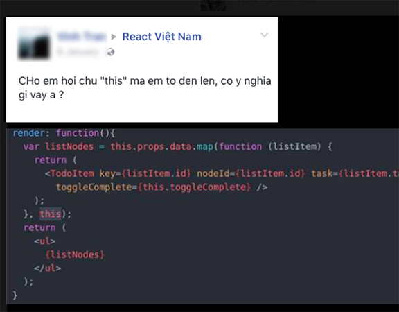

???
Give another example about Angular candidate

---

### A proposal:

- **It's fine** if you start learning and doing JS frameworks
- You should have a **mentor / leader** to guide and help explain uncertainties
- You keep **learning the basics**
- Join the technical groups on FB, forums
- Go to technical sharing talks

---
class: animated, fadeIn, center, middle
# Front End Trend 2017
.logo[]

---
layout: true
class: animated, fadeIn
.topic[Front End Trend 2017]

---
### Universal JavaScript Applications

- Single Page Application
- Server side rendering
- History push state
- Server side JavaScript

(Demo with Kuadobox)

---
### Functional programming with JS

- ES6 new core objects methods.
  Example: Array.prototype.map()
- REDUX & Reducers
- Immutables & pure functions
- lodash's FP module

---

### Declarative programming*

- Virtual DOM (React, Vue, Preact)
- Reactive programming (RxJS, Angular 2)
- GraphQL (Relay, GraphQL Express)

.footnote[vs. Imperative programming]

---

### Unidirectional data flow architecture*

- Success of Flux and it's implementations
- Redux
- MobX

.footnote[*in contrast with MVC architecture on Front End]

---

### Progressive Web App

- Service worker
- Web Push Notification
- Webapp's manifest.json
- Web IndexDB
- Web Payment API
- Web Authentication API

---

### RAIL performance model

.center[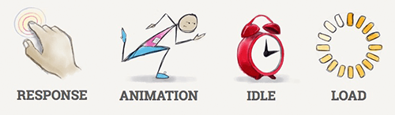]

--
.center[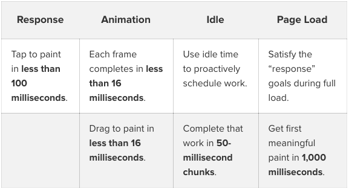]

.footnote[Source: [SmashingMagazine](https://www.smashingmagazine.com/2015/10/rail-user-centric-model-performance/)]

---
layout: false
class: animated, fadeIn, center, middle
# Questions & Answers

---
class: animated, fadeIn, center, middle
# Thanks
### The End

This talk slides: [bit.ly/codecamp-fe2017](http://bit.ly/codecamp-fe2017)

---
exclude: true

Front End Handbook:
https://www.frontendhandbook.com

Baseline for FE Developer
http://blog.int3ractive.com/2015/06/baseline-for-modern-front-end-developers.html

PE
http://blog.int3ractive.com/Presentation--Progressive-Enhancement/

The JS scene of 2016
https://hackernoon.com/how-it-feels-to-learn-javascript-in-2016-d3a717dd577f

